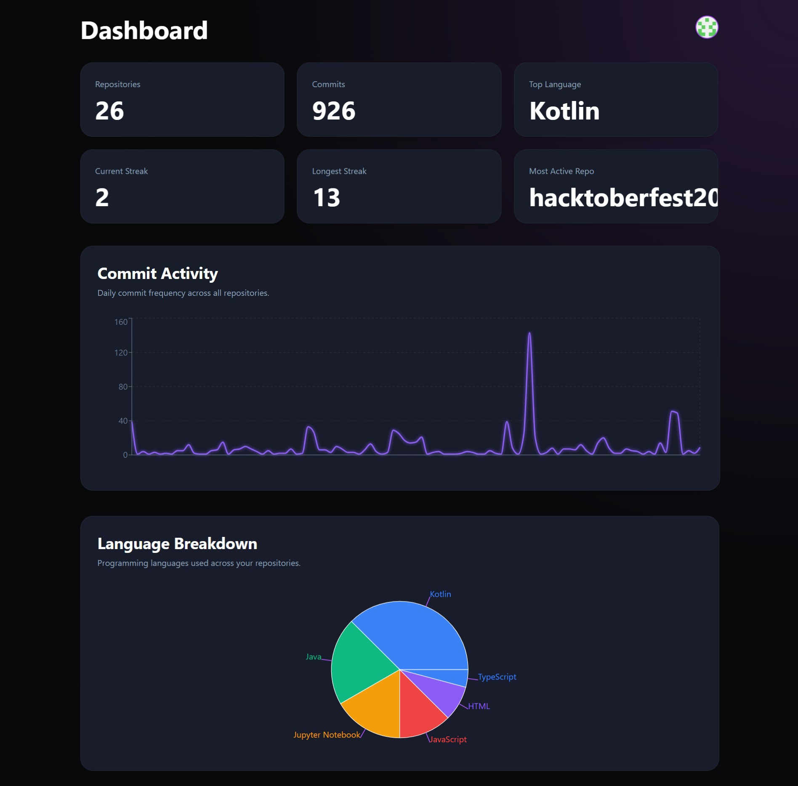

# 🚀 DevPulse

> A real-time GitHub Analytics Dashboard built with Spring Boot, React, WebSockets, PostgreSQL, Redis, and GitHub OAuth.

DevPulse allows developers to securely log in with GitHub and visualize repository analytics, commit activity, pull requests, contribution trends, language distribution, and more through an interactive dashboard.

---

## 📸 Screenshots

### 🔐 Login Page

<p align="center">
  
</p>

---

### 📊 Dashboard

<p align="center">
  
</p>

---

# ✨ Features

- 🔐 Secure GitHub OAuth Authentication
- 📈 Real-Time Dashboard
- 📂 Repository Analytics
- 📊 Commit Activity Visualization
- 🔥 Contribution Heatmap
- 🧑‍💻 Language Distribution Chart
- 🔄 One-click GitHub Synchronization
- ⚡ Live Updates using WebSockets
- 🔑 JWT Authentication
- 📦 PostgreSQL Database
- 🚀 Redis Caching
- ☁️ Deployed on Render + Vercel

---

# 🛠 Tech Stack

## Frontend

- React
- TypeScript
- Vite
- Tailwind CSS
- Axios
- React Router
- Chart.js
- SockJS
- STOMP.js

## Backend

- Spring Boot
- Spring Security
- Spring OAuth2 Client
- JWT Authentication
- Spring WebSocket
- Spring Data JPA
- Hibernate

## Database

- PostgreSQL (Neon)

## Cache

- Redis (Upstash)

## Deployment

- Backend → Render
- Frontend → Vercel

---

# 🏗 Architecture

```
                GitHub OAuth
                      │
                      ▼
              Spring Boot Backend
                      │
        ┌─────────────┼──────────────┐
        │             │              │
        ▼             ▼              ▼
   PostgreSQL      GitHub API     Redis Cache
        │
        ▼
   WebSocket Server
        │
        ▼
     React Frontend
```

---

# 📊 Dashboard Includes

- Repository Count
- Commit Count
- Pull Request Statistics
- Commit Activity Graph
- Language Distribution Pie Chart
- Contribution Heatmap
- Profile Information
- Real-Time Activity Feed

---

# 🔐 Authentication Flow

```
User
   │
   ▼
GitHub OAuth
   │
   ▼
Spring Security
   │
   ▼
Generate JWT
   │
   ▼
React Dashboard
```

---

# 📁 Project Structure

```
DevPulse
│
├── Backend
│   ├── Controller
│   ├── Service
│   ├── Repository
│   ├── Entity
│   ├── Config
│   ├── Security
│   └── DTO
│
├── Frontend
│   ├── components
│   ├── pages
│   ├── api
│   ├── assets
│   └── websocket
│
└── Database
```

---

# ⚙️ Environment Variables

## Backend

```
SPRING_DATASOURCE_URL=
SPRING_DATASOURCE_USERNAME=
SPRING_DATASOURCE_PASSWORD=

REDIS_HOST=
REDIS_PORT=
REDIS_PASSWORD=

GITHUB_CLIENT_ID=
GITHUB_CLIENT_SECRET=

JWT_SECRET=

FRONTEND_URL=
```


---


# 🌐 Live Demo

**Frontend**

```
https://devpulse-frontend-ebon.vercel.app
```

**Backend**

```
https://devpulse-1z97.onrender.com
```

---


# 🤝 Contributing

Contributions are always welcome!

1. Fork the repository
2. Create your feature branch

```bash
git checkout -b feature/AmazingFeature
```

3. Commit your changes

```bash
git commit -m "Add AmazingFeature"
```

4. Push to the branch

```bash
git push origin feature/AmazingFeature
```

5. Open a Pull Request

---

# 👨‍💻 Author

**Avnish Singh**

GitHub: https://github.com/Avnish666

---

# ⭐ If you like this project

Give it a ⭐ on GitHub!
